# 环境准备

```bash
开课前环境准备
- 1. 如果你用的Windows系统，建议在Windows上安装虚拟机，在虚拟机上安装Linux系统，Linux系统上运行Python环境；
- 2. 如果你用的是Mac系统，那么可以直接在Mac上运行Python环境；
- 3. 虚拟机建议用Virtualbox + Vagrant, 为什么要用这款软件了？？？ 
- 3.1 这款软件能够实现Windows下项目代码和Linux系统共享；
- 3.2 Pycharm支持连接Virtualbox里的Python环境；
```

## 1. Windows系统


### 1.1 安装虚拟机

> Virtualbox是一款虚拟机软件(类似于Vmware)，Vagrant是Virtualbox的命令行管理工具, Box是虚拟机镜像；


> 1.1.1. 首先安装Virtualbox；

- [Virtualbox Download](https://download.virtualbox.org/virtualbox/5.2.26/VirtualBox-5.2.26-128414-Win.exe)


> 1.1.2. 安装Vagrant，如下图表示安装成功；

- [Vagrant Download](https://releases.hashicorp.com/vagrant/2.2.4/vagrant_2.2.4_x86_64.msi)


> 1.1.3. Vagrant命令行方式创建虚拟机；

- [Box List](http://www.vagrantbox.es/)
- [Box Centos6.6](https://github.com/tommy-muehle/puppet-vagrant-boxes/releases/download/1.0.0/centos-6.6-x86_64.box)
- [Box Centos6.6 (aliyun oss)](https://51reboot.oss-cn-beijing.aliyuncs.com/%E8%AE%AD%E7%BB%83%E8%90%A51%E6%9C%9F/%E8%BD%AF%E4%BB%B6%E5%8C%85/centos-6.6-x86_64.box)


1.1.3.1 Vagrant常用命令

```bash
1. vagrant box list  // 列出当前导入的Box
2. vagrant up        // 启动虚拟机
3. vagrant halt      // 关闭虚拟机
4. vagrant status    // 查看虚拟机的状态
5. vagrant init      // 初始化虚拟机
6. vagrant box add <BoxPath>  // 添加box
```

1.1.3.2 进入Windows下的CMD命令行，使用Vagrant命令行工具来启动一台虚拟机。

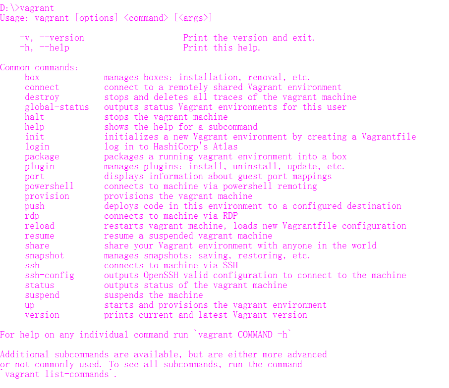
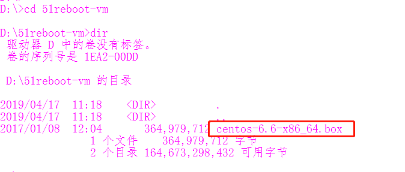
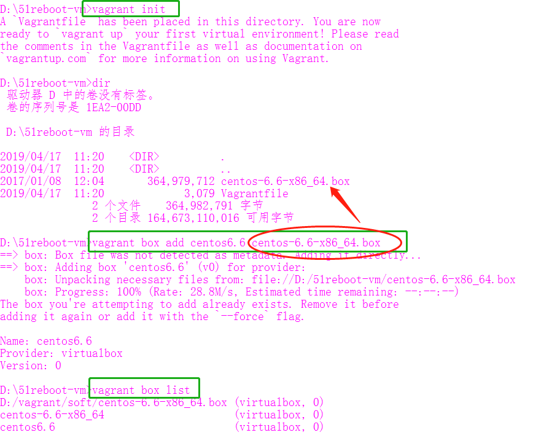
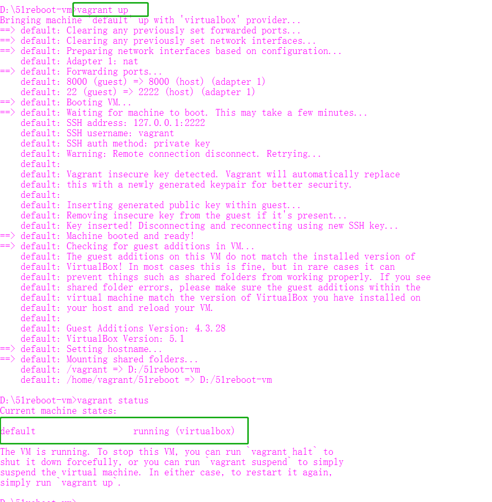


1.1.3.3 使用xshell连接上Virtualbox虚拟机
> 登陆用户名 vagrant，登陆密码 vagrant，ssh端口 2222    

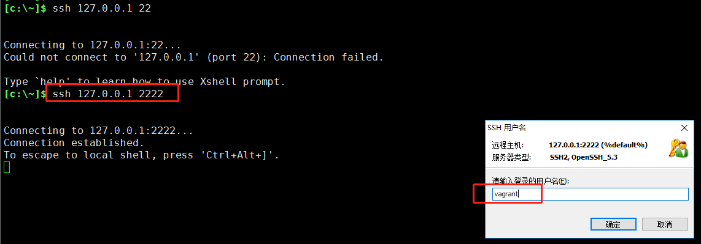
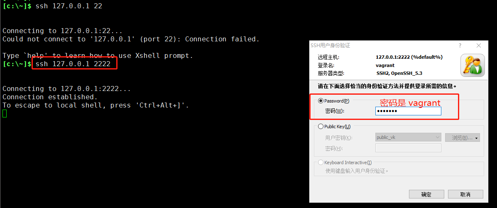
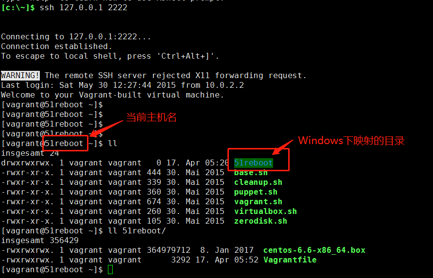


### 1.2. Python 3.6

> Linux安装
```bash
# yum install gcc gcc-c++ make openssl openssl-devel
# cd /usr/local/src
# wget https://www.python.org/ftp/python/3.6.8/Python-3.6.8.tgz
# tar -zxvf Python-3.6.8.tgz
# cd Python-3.6.8
# ./configure --prefix=/usr/local/python36
# make -j
# mkae install
```

> 环境变量
```bash
# echo "export PATH=/usr/local/python36/bin:\$PATH" > /etc/profile.d/python36.sh
# source /etc/profile
```

> 测试版本
```bash
# python3 -V
Python 3.6.8
```

### 1.3. IDE

1.3.1 下载Pycharm 2019

- [Pycharm Download](https://www.jetbrains.com/pycharm/download/download-thanks.html?platform=windows)


1.3.2 安装Pycharm

- [注册码地址](http://idea.lanyus.com)

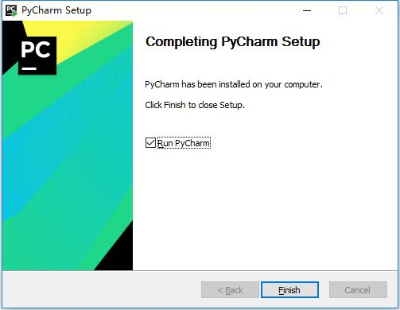
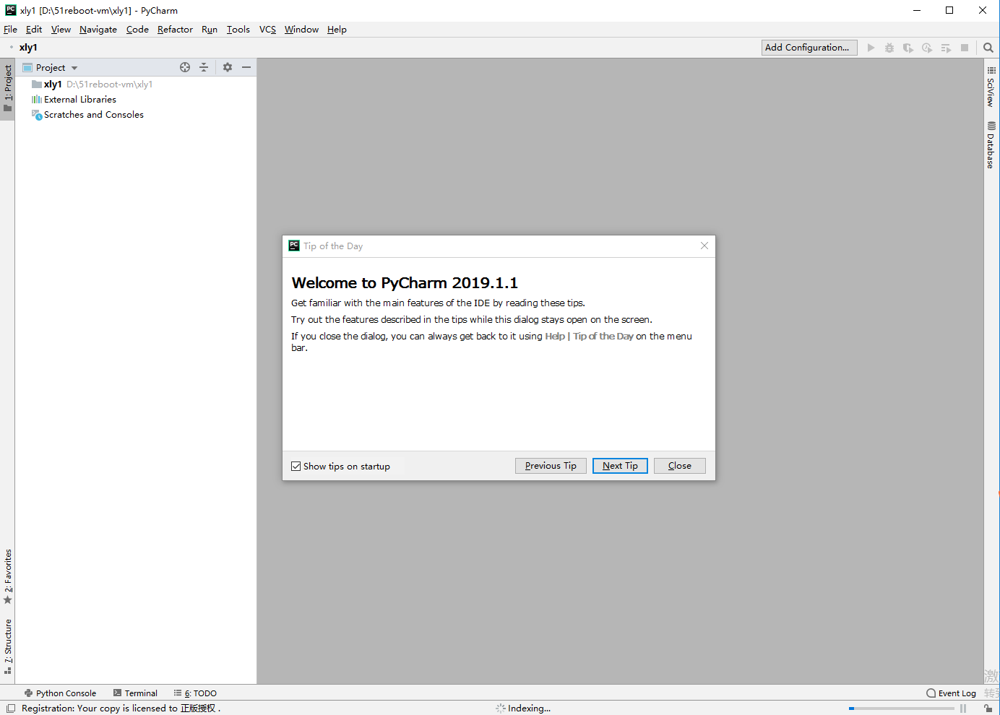


1.3.3 Pycharm设置连接Vagrant虚拟机的Python环境，如下图；

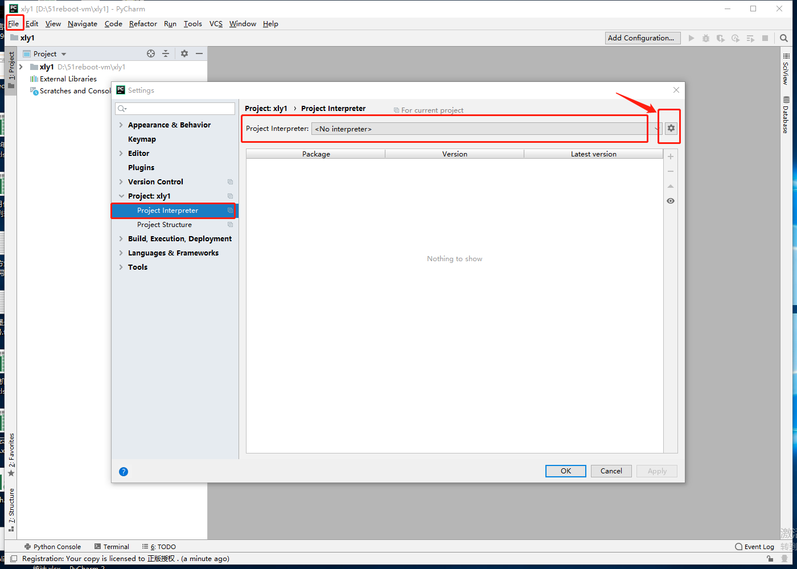
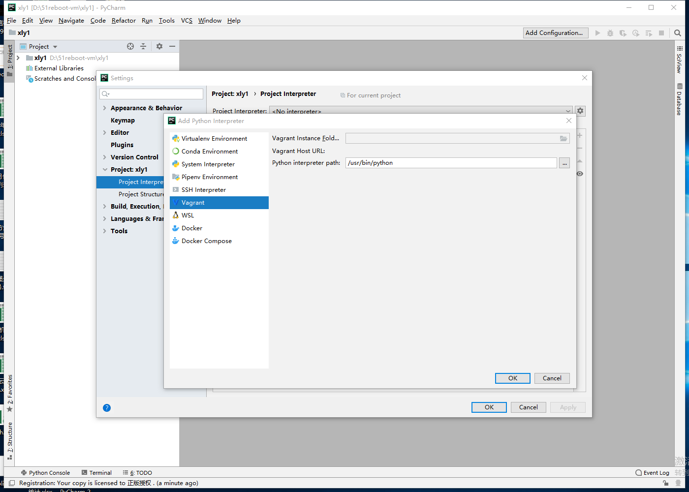
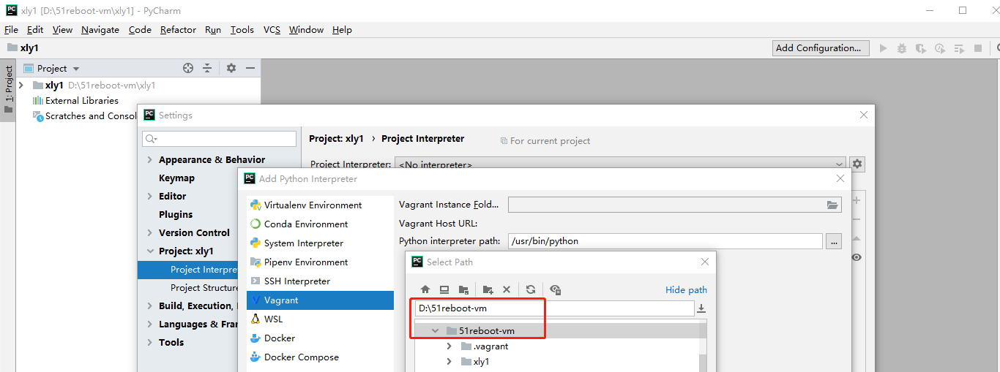
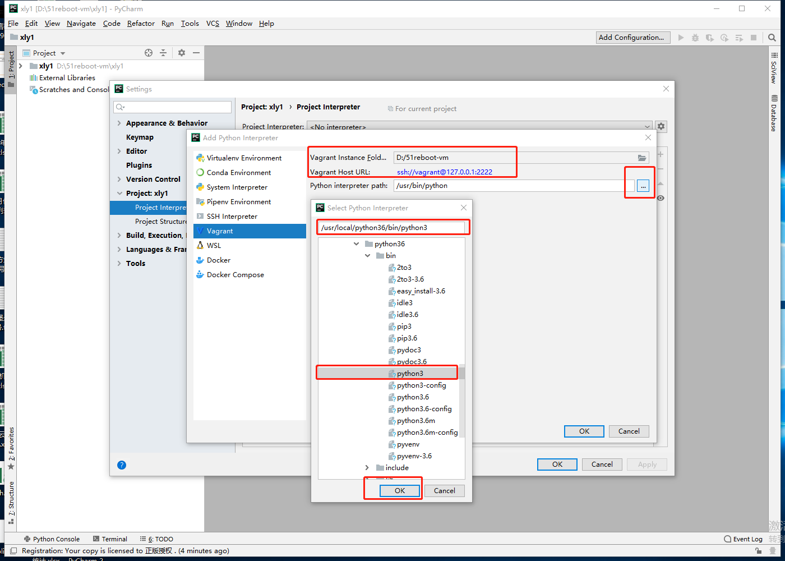
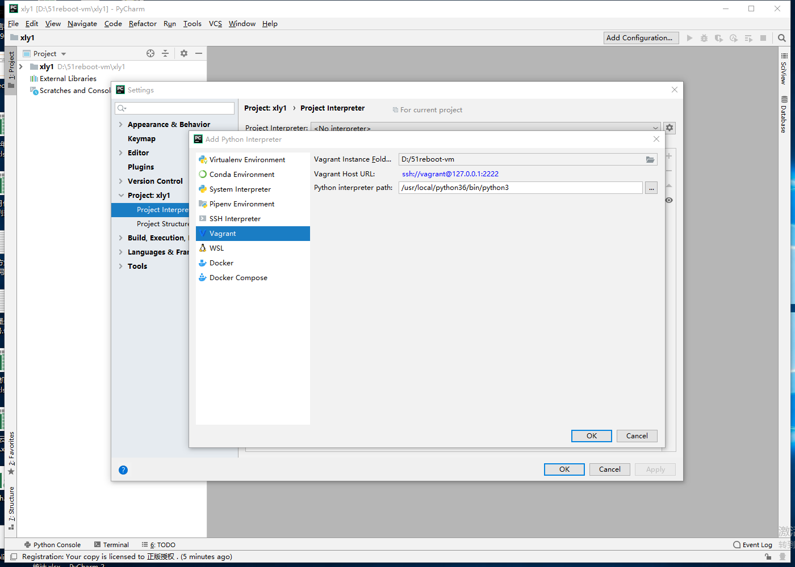
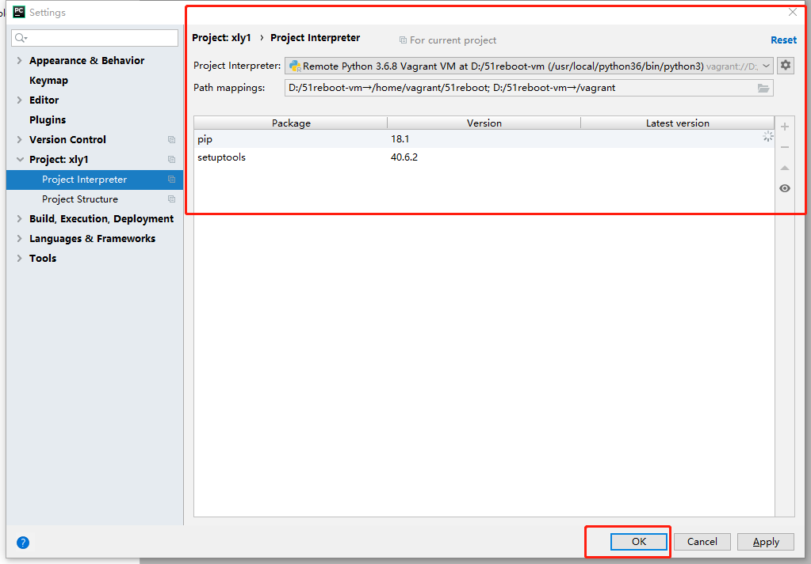
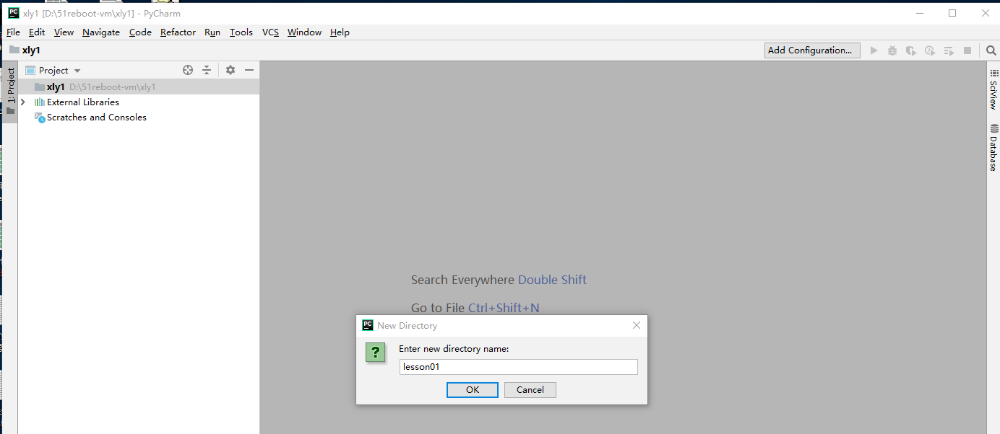
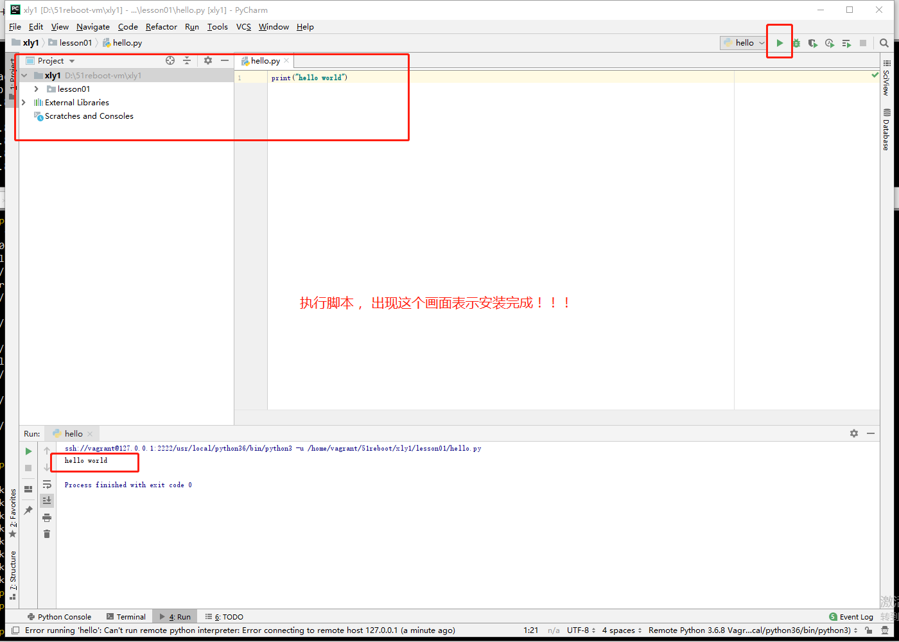


## 2. Mac系统


### 2.1. Mac安装Python 3.6

- [Mac Download](https://www.python.org/ftp/python/3.6.8/python-3.6.8-macosx10.9.pkg)


> 测试版本
```bash
# python3 -V
Python 3.6.8
```


### 2.2. IDE

2.2.1 下载Pycharm 2019

- [Pycharm Download](https://www.jetbrains.com/pycharm/download/download-thanks.html?platform=mac)
